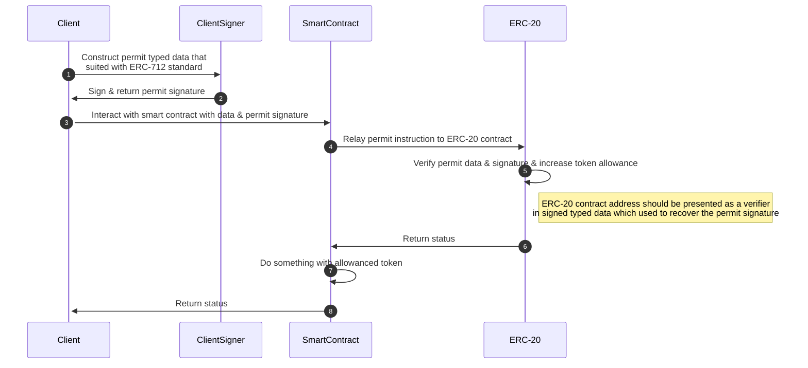

## Example: How relayed permit work

```mermaid
sequenceDiagram
    autonumber
    Client->>ClientSigner: Construct permit typed data that <br/>suited with ERC-712 standard
    ClientSigner->>+Client: Sign & return permit signature
    Client->>SmartContract: Interact with smart contract with data & permit signature
    SmartContract->>ERC-20: Relay permit instruction to ERC-20 contract
    ERC-20->>ERC-20: Verify permit data & signature & increase token allowance
    Note right of ERC-20: ERC-20 contract address should be presented as a verifier <br/>in signed typed data which used to recover the permit signature
    ERC-20->>SmartContract: Return status
    SmartContract->>SmartContract: Do something with allowanced token
    SmartContract->>Client: Return status
```
